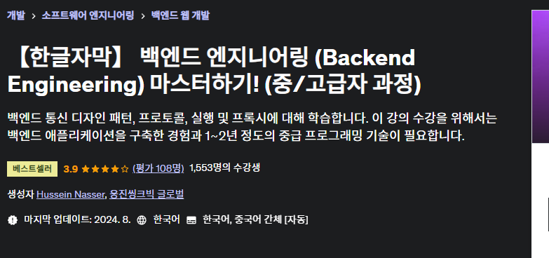

# Study-Backend 필기 노트
유데미 백엔드 엔지니어링 강의를 듣고 필기함




---

## 📚 목차

1. [개요](#개요)
2. [구조](#구조)
3. [사용 방법](#사용-방법)
4. [기여 방법](#기여-방법)
5. [라이선스](#라이선스)

---

## 개요

이 저장소는 다음을 목적으로 합니다:

- **요약:** 강의의 주요 내용을 간략하게 정리.
- **다이어그램 및 시각화:** 개념을 설명하기 위한 유용한 그림.
- **참고 자료:** 추가 자료, 읽을거리, 도구에 대한 링크.

각 노트는 주제를 간략하면서도 포괄적으로 이해할 수 있도록 작성되었습니다.

---

## 구조

저장소는 다음과 같이 구성되어 있습니다:

```
.
├── Topic1/
│   ├── lecture1.md
│   ├── lecture2.md
│   └── resources/
├── Topic2/
│   ├── lecture1.md
│   ├── diagrams/
│   └── references.md
└── README.md
```

- 각 주제는 개별 디렉토리로 구성되어 있습니다.
- 각 주제의 노트, 다이어그램, 참고 자료는 해당 폴더 안에 정리되어 있습니다.

---

## 사용 방법

1. 저장소 클론:

   ```bash
   git clone https://github.com/your-username/lecture-notes.git
   ```

2. 관심 있는 주제나 강의로 이동합니다.

3. 노트와 자료를 탐색:

   ```bash
   cd Topic1
   cat lecture1.md
   ```

---

## 기여 방법

기여를 환영합니다! 다음 단계를 통해 참여할 수 있습니다:

1. 저장소를 포크합니다.
2. 새 브랜치를 만듭니다:

   ```bash
   git checkout -b feature/your-feature-name
   ```

3. 변경 사항을 작성하고 커밋:

   ```bash
   git commit -m "강의 3에 대한 상세 노트 추가"
   ```

4. 브랜치를 푸시:

   ```bash
   git push origin feature/your-feature-name
   ```

5. 풀 리퀘스트를 생성합니다.

---

## 라이선스

이 프로젝트는 MIT 라이선스를 따릅니다. 자세한 내용은 `LICENSE` 파일을 참고하세요.

## [강의링크](https://www.udemy.com/course/fundamentals-of-backend-engineering-communications-protocols-korean/?couponCode=KEEPLEARNING)